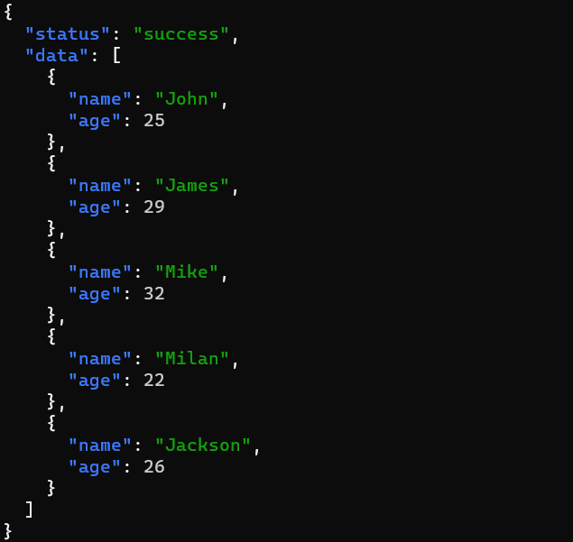
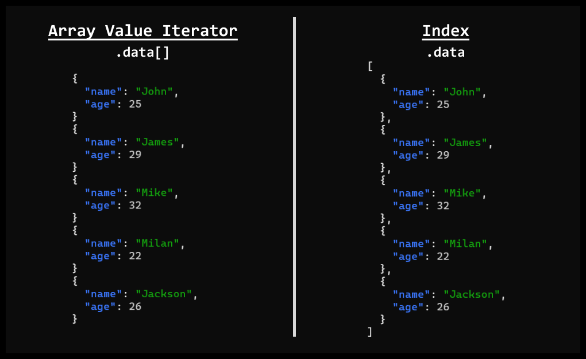

# JQ parser


Command-line JSON processor

---

# Introduction

- jq is a lightweight and flexible command-line JSON processor.

-  jq is like `sed` for JSON data - you can use it to slice and filter and map and transform structured data with the same ease that `sed`, `awk`, `grep` and friends let you play with text.

---

## Sed

Sed is a advance text editor for filtering and transforming text input.

### Features of Sed
- Select text
- Subsitute text
- Add lines to text
- Delete lines from text
- Modify an original File 

---

## Sed Application

```bash
cat samples/zen_of_python.txt
```


---
## Sed Application

```bash
sed -n '3,8p' samples/zen_of_python.txt
```


---

## Sed Application

```bash
sed -n '3,8p' samples/zen_of_python.txt | sed 's/better/fancy/'
```


---
# Getting Started



```bash
sudo apt install -y jq
```

```bash
jq '.' example.json
```

---
# Selection


<!-- Absolute simplest filter: '.'
Object Identifier-Index: '.sample' -->


```bash
jq '.sample' example.json
jq '.data' example.json
jq '.data[0]' example.json
jq '.data[0].name' example.json
```

---

# Array Indexing
Indexing in `jq` is similar to like `python`
```bash
jq '.data[2:4]' example.json
```
```python
num_list = [1,2,3,4,5]
num_list[2:4]
```

---

## Array Selecting



---

# Selecting Multiple Index

```bash
jq '.data[] | .name, .age' example.json
```

---

# Construction

### 1. Array Construction: `[]`
### 2. Object Construction: `{}`

---

# Array & Object constructor


```bash
jq '[.data[] | { name: .title, cost: .price}]' books.json
```


---

## JQ built-in functions
Some useful functions
1. sort
2. length
3. keys
4. type
5. min
6. max
7. unique

---

## JQ built-in functions

```bash
jq '.data | length' books.json
```

---
